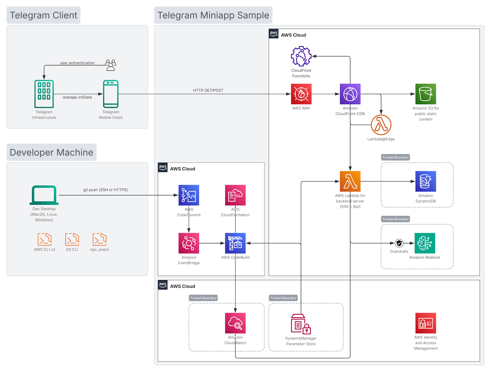

# Sample of Telegram Mini App and Bot on AWS serverless infrastructure

This code sample demonstrates how to deploy Telegram Mini Apps and Telegram Bot applications to AWS serverless infrastructure using popular web frameworks with Server-Side Rendering support.

#### Main goal
The goal of this sample is to allow developers:
- to deploy Telegram Mini App to the cloud infrastructure within minutes
- to scale the application from 0 to a thousand active users
- to effectively manage infrastructure costs starting from $0/month and grow with pay-as-you-go cost model
- to share a single codebase for frontend, backend and bot
- to speed up development with both vibe-coding and spec-based agentic AI development

#### Code stack:
- Languages: **TypeScript**
- Frontend and backend: **React Router v7** [↗️](https://reactrouter.com/) in the Framework mode
- Telegram Bot framework: **grammY** [↗️](https://grammy.dev/)
- Telegram Mini Apps SDK: **@tma.js** [↗️](https://github.com/Telegram-Mini-Apps/tma.js#readme)
- Monorepo management: **pnpm** [↗️](https://pnpm.io/workspaces)
- Version control: **Git** [↗️](https://git-scm.com/about)
- Infrastructure as code: **AWS CDK v2** [↗️](https://docs.aws.amazon.com/cdk/v2/guide/home.html)
- Cloud infrastructure access: **AWS CLI v2** [↗️](https://docs.aws.amazon.com/cli/latest/userguide/getting-started-install.html)

<!-- **SvelteKit 5** [↗️](https://svelte.dev/docs/kit/introduction) -->

## Table of Contents

- [Quick Start](#quick-start)
- [Architecture](#architecture)
- [Intended Use-Case](#intended-use-case)
- [Register new Telegram Bot](#register-new-telegram-bot)
- [Configure Telegram Mini App](#configure-telegram-mini-app)
- [Scalability and Cost](#scalability-and-cost)
- [Troubleshooting](#troubleshooting)
- [Supported environments](#supported-environments)
- [Clean Up](#clean-up)
- [License](#license)
- [Additional Resources](#additional-resources)

---
<br><br>

# Quick Start

1. Register a Telegram Bot using [@BotFather](https://t.me/botfather) and obtain **Bot Token**.
1. Make sure your laptop has [AWS CLI v2](https://docs.aws.amazon.com/cli/latest/userguide/getting-started-install.html) and [Git CLI](https://git-scm.com/install/) and [Node.js v22+](https://nodejs.org/en/download) installed
1. Sign in to [AWS Management Console](https://console.aws.amazon.com/)
1. Run deployment script on your laptop (MacOS, Linux, WSL)**\*** or in [AWS CloudShell](https://console.aws.amazon.com/cloudshell/home):

~~~bash
# login to AWS on your laptop:
#(please skip 'aws login' if you use AWS CloudShell)
aws login

# check prerequisites and deploy Mini App in a guided mode:
npx --yes https://github.com/aws-samples/sample-telegram-miniapp my-app
~~~

**\*Note:** see [Supported environments](#supported-environments) for details on deployment environment prerequisites

---
<br><br>

# Architecture
- Compute: **AWS Lambda**
- Public static content store: **Amazon S3**
- Session store: **Amazon DynamoDB**
- Content Delivery Network: **Amazon CloudFront**
- DDoS protection and application firewall: **AWS WAF**
- Large Language Model (LLM) inference: **Amazon Bedrock**
- LLM protection: **Amazon Bedrock Guardrails**
- Cloud infrastructure management: **AWS CloudFormation**
- Code repository: **AWS CodeCommit**
- Code build automation: **AWS CodeBuild** + **Amazon EventBridge**
- Logs ingestion and storage: **Amazon CloudWatch** + **Amazon S3**




---
<br><br>

# Intended Use-Case

This Mini App sample has absolutely no specific use-case in itself. It has no other purposes but learning by demonstrating integration details.

It's up to you to develop your own Telegram Mini App application with your specific use-case, and we hope that this code sample would help you to get your hands on this topic easier and faster.

Even though it might look like a complete and functional web application, it's just a sample that demonstrates a few useful concepts that help developers to get started with Mini App development quicker:

- Serverless infrastructure for cost management
- Serverless infrastructure for scalability
- Server-Side Rendering in a context of Serverless infrastructure
- React Router v7 Framework mode in a context of Telegram Mini Apps
- Shared backend for both grammY bot framework and React web framework
- Telegram API access through @tma.js SDK to invoke functions like:
1. QR code scanner
1. Haptic feedback
1. Shake detection
1. Gyroscope orientation
1. GPS location
1. "Add to Home Screen" feature


---
<br><br>

# Register new Telegram Bot

If you haven't done so already, please create your Telegram Bot that would be connected to your Telegram Mini App project later:

1. Open Telegram [@BotFather](https://t.me/botfather) in your Telegram client app
2. Send `/newbot` command and follow the prompts to create your bot
3. Copy the **Bot Token** (a secret string of format: `123456789:ABCdefGHIjklMNOpqrsTUVwxyz`)

For detailed instructions, see the [Telegram Bot FAQ](https://core.telegram.org/bots/faq).

⚠️**IMPORTANT**: please never hard-code or commit the **Bot Token** into your application code. The token has to be considered sensitive information. The Mini App sample deployment script will ask you for your Bot Token and store it in the application parameters in the cloud separately from your code so the token does not need to be committed to a code repository.


---
<br><br>

# Configure Telegram Mini App

After successful deployment to AWS, the deployment script writes all the details that you need for Mini App configuration into **docs/REPORT.md** file in your repository. You can also generate such report at any time using `pnpm run report --output my_file.md`

1. Find your **Miniapp_URL** in the deployment report `docs/REPORT.md`
2. Open [@BotFather](https://t.me/botfather) in Telegram client
3. Launch [@BotFather](https://t.me/botfather) Mini App by clicking on `Open` button in lower left corner
4. Choose your **Bot**
5. Click on **Mini Apps** menu
6. Use your **Miniapp_URL** to configure two or more ways of launching your Mini App:
- **Menu Button**
- **Main App**
- optional: one or more **Direct Links**


---
<br><br>

# Scalability and Cost

This sample uses AWS Serverless infrastructure that is especially efficient when you just start your Mini App project or launching MVP and looking for:
- pay-as-you-go model for infrastructure costs
- ability to start as low as $0 per month should your application demonstrate small active user base
- ability to scale quickly up to thousands active users per month or millions requests per day should your application demonstrate fast adoption
- ability to migrate to container-based scale-out architectures should your workload grow beyond thousand active users per month.

### AWS Services

Please consult official [AWS Pricing](https://aws.amazon.com/pricing/) and [AWS Pricing Calculator](https://calculator.aws/#/) pages for latest information and details.

Here's a brief extraction on pricing for the main services used in this sample:

| Service | Pricing Model | Source | Brief pricing model |
|---------|---------------|---------|---------------------------|
| **CloudFront** (Mini App) | Flat-rate plans | [official pricing](https://aws.amazon.com/cloudfront/pricing/) | Free, Pro, Business, Premium |
| **CloudFront** (Bot webhook) | Pay-as-you-go | [official pricing](https://aws.amazon.com/cloudfront/pricing/pay-as-you-go/) | $0.085 per GB  +  $0.01 per 10K HTTPS requests |
| **Lambda Function** ARM, 256MB | Pay-as-you-go | [official pricing](https://aws.amazon.com/lambda/pricing) | ~$0.20 per million requests + $0.0000034 per second of actual execution time |
| **Lambda@Edge** x86 | Pay-as-you-go | [official pricing](https://aws.amazon.com/lambda/pricing/#Lambda.40Edge_Pricing) | ~$0.60 per million requests + $0.00000625125 per second of actual execution time |
| **DynamoDB** | On-Demand | [official pricing](https://aws.amazon.com/dynamodb/pricing/on-demand/) | $0.625 per million write request units, $0.125 per million read request units |
| **S3** | Pay-as-you-go | [official pricing](https://aws.amazon.com/s3/pricing) | $0.023 per GB/month |
| **WAF** | Flat-rate plans OR Pay-as-you-go | [official pricing](https://aws.amazon.com/waf/pricing) | $0.60 per million requests + $5/month base + $1/month per rule |

#### Free Tier

Please check information on [AWS Free Tier](https://aws.amazon.com/free/) program.

---
<br><br>

# Troubleshooting

### Deployment Issues

```bash
# Ensure aws CLI has authenticated with your AWS account
aws login

# Ensure AWS credentials are configured
aws sts get-caller-identity

# Bootstrap CDK in your account
pnpm run bootstrap
```

**Build Failures**
```bash
# Clean and rebuild
pnpm run -r build --force

# Check for TypeScript errors
pnpm --filter "@gui/react" typecheck
```

---
<br><br>

# Supported environments

> ℹ️ Hint:<br> For the first time deployment you can just open [AWS CloudShell](https://console.aws.amazon.com/cloudshell/home) and run the **npx** command there. This environment has all the tools installed and doesn't require any additional time for preparation.

#### Operating Systems
The following OS/environments should be suitable for sample deployment:

- AWS CloudShell
- MacOS 13.5+
- Ubuntu 22.04+
- Linux [supported by Node.js](https://github.com/nodejs/node/blob/main/BUILDING.md) v22+
- WSL 2 on Windows 10+
- Windows 10/11

#### Tools
The following tools have to be installed on your dev machine:
- **AWS** CLI v2 ([install](https://docs.aws.amazon.com/cli/latest/userguide/getting-started-install.html))
- **Git** CLI ([install](https://git-scm.com/install/))
- **Node.js** version 22+ ([install](https://nodejs.org/en/download))
- **pnpm** version 10.20+ ([install](https://pnpm.io/installation))

---
<br><br>

# Clean Up

To avoid ongoing charges, delete all deployed resources:

### 1. Delete CDK Stacks

```bash
pnpm run destroy-me
```

This removes:
- **data** from S3 buckets
- **data** from DynamoDB tables
- **data** from CodeCommit repositories
- **data** from CloudWatch log groups
- S3 Buckets
- DynamoDB Tables
- CodeCommit repositories
- CloudWatch Log Groups
- CloudFront Distributions
- Lambda Functions
- SSM Parameters

#### This might still leave for manual deletion:
- **Lambda@Edge** function in us-east-1 region (takes time to delete function replication)
- **CloudFront** distribution that was covered by **Flat-Rate Plan** (it waits until the end of billing period)
- **WebACL** in us-east-1 region that was associated with CloudFront distribution that wasn't removed automatically

### 2. Delete Telegram Bot (optional)

If you no longer need the bot:
1. Open [@BotFather](https://t.me/botfather)
2. Send `/deletebot`
3. Select your bot
4. Confirm deletion

### 3. Verify Cleanup

Check AWS Console to ensure all resources are deleted:
- WAF → WebACLs and IP Sets
- CloudFront → Distributions
- CloudFormation → Stacks
- Lambda → Functions
- CloudWatch → Log Groups
- DynamoDB → Tables
- S3 → Buckets
- CodeCommit → Repositories
- CodeBuild → Projects

---
<br><br>

# License

This sample code is made available under the MIT-0 license. See the LICENSE file for details.

---
<br><br>

# Additional Resources

- [Telegram Bot API Documentation](https://core.telegram.org/bots/api)
- [Telegram WebApp Documentation](https://core.telegram.org/bots/webapps)
- [Telegram Mini Apps community and samples](https://github.com/telegram-mini-apps)
- [@tma.js Mini Apps SDK](https://github.com/Telegram-Mini-Apps/tma.js#readme)
- [grammY Telegram Bot Framework](https://grammy.dev/)
- [React Router v7 Documentation](https://reactrouter.com/)
- [SvelteKit Documentation](https://svelte.dev/docs/kit)
- [AWS CDK Documentation](https://docs.aws.amazon.com/cdk/)
- [TON Studio TMA](https://docs.ton.org/ecosystem/tma/overview)